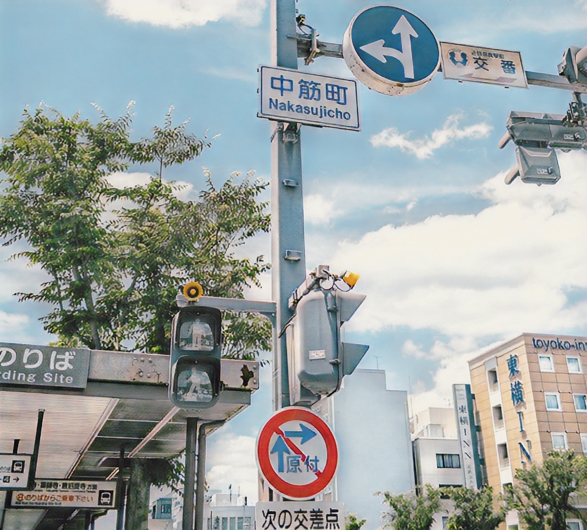

# CV_project
Project for the course of Comp. Vision in Georgetown University
- Team Members: Shuheng Gong, Wei Li


## 1.Slides and model
- Our slides named "CV_project.pptx"
- We put our model trained by ourselves in 'release', named 'AnimeGAN'(including generator and discriminator)


## 2.Training details of Colab
```xml
Python 3 Google Compute Engine backend
V100 GPU

!python3 train.py --real_image_dir '/content/dataset/train_photo'\
                  --anime_image_dir '/content/dataset/Shinkai'\
                  --batch 8\
                  --model v2\
                  --amp --cache\
                  --init_epochs 10\
                  --exp_dir {working_dir}\
                  --gan_loss lsgan\
                  --init_lr 0.0001\
                  --lr_g 0.00002\
                  --lr_d 0.00004\
                  --wadvd 300.0\
                  --wadvg 300.0\
                  --wcon 1.5\
                  --wgra 3.0\
                  --wcol 70.0\
                  --use_sn\
                  #--epochs 70
                  #--resume_G '/content/drive/MyDrive/animeGAN/GeneratorV2_train_photo_Shinkai.pt'\
                  #--resume_D '/content/drive/MyDrive/animeGAN/discriminator_train_photo_Shinkai.pt'\
```
- Our training details and results are in the CV_project/animeGAN.ipynb file.
- Or you can check training notebook by GU Account on : [google colab](https://colab.research.google.com/drive/1Jk11AZO-pmQRfcGF3t-D3aLqSV9KZVq9#scrollTo=cn88CEIiHWE3)

## 3. Dataset
[https://github.com/Abel3369/CV_project/releases/tag/dataset2.0](https://github.com/Abel3369/pytorch-animeGAN/releases/tag/v2.0)
- The file "real-world" contains 6,656 real-world photos, which are 256 x 256 JPEG images used as inputs for the model.
- The file "anime_images" contains 2000 smoothed anime-style images , which are 256 x 256 JPEG images used as inputs for the model.
- In the existing dataset, we captured images from Makoto Shinkai's latest anime movies ("The Garden of Words") and a previous film ("5 Centimeters Per Second") using an FFMPEG script and selected some that are brightly lit. After smoothing these images, we then used them as inputs.
- dataset_url = 'https://github.com/Abel3369/pytorch-animeGAN/releases/download/v2.0/dataset2.0.zip'

## 4. Results
| Input | Shinkai style |
|--|--|
|||
|||
|||
|||
|||

## 5. Refernce:
- https://github.com/TachibanaYoshino/AnimeGAN
- https://github.com/ptran1203/pytorch-animeGAN
- https://github.com/TachibanaYoshino/AnimeGAN/blob/master/doc/Chen2020_Chapter_AnimeGAN.pdf
- https://github.com/Abel3369/pytorch-animeGAN (This is the repository we actually utilize, which includes the model code, functions required for AnimeGAN in Colab, and the dataset that has been modified. Or you can check it in this CV_project/pytorch-animeGAN/)
